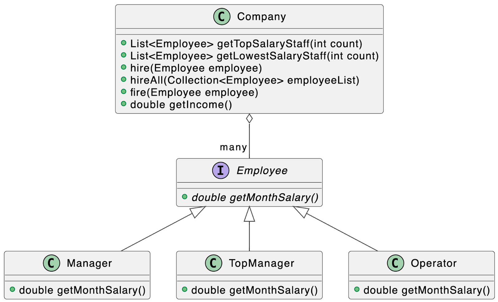

# Цель
Научиться работать с интерфейсами, абстрактными классами и взаимодействием классов.

## Что нужно сделать
Выполните задание в репозитории java_basics в проекте AbstractClasses/practice_1. __Директория пустая, вам необходимо в ней создать новый проект и выполнить задание.__

1. Создайте класс компании Company, содержащей сотрудников и реализующей методы:

* найм одного сотрудника — hire(Employee employee),
* найм списка сотрудников – hireAll(Collection<Employee> employes),
* увольнение сотрудника – fire(Employee employee),
* получение значения дохода компании – getIncome().
Каждый метод __НЕ должен__ иметь модификатор static, это позволит каждому объекту класса Company иметь свой набора сотрудников, свой расчет дохода, увольнение и найм. Аргументы и возвращаемое значение методов выберите на основании логики работы вашего приложения.

2. Создайте два метода, возвращающие список указанной длины (count). Они должны содержать сотрудников, отсортированных по убыванию и возрастанию заработной платы:

* List<Employee> getTopSalaryStaff(int count),
* List<Employee> getLowestSalaryStaff(int count).

3. Создайте классы сотрудников с информацией о зарплатах и условиями начисления зарплаты:

* Manager — зарплата складывается из фиксированной части и бонуса в виде 5% от заработанных для компании денег. Количество заработанных денег для компании генерируйте случайным образом от 115 000 до 140 000 рублей.
* TopManager — зарплата складывается из фиксированной части и бонуса в виде 150% от заработной платы, если доход компании более 10 млн рублей.
* Operator — зарплата складывается только из фиксированной части.
Каждый класс сотрудника должен имплементировать интерфейс Employee. В интерфейсе Employee должен быть объявлен метод, возвращающий зарплату сотрудника, — getMonthSalary().

Аргументы и возвращаемое значение метода выберите в соответствии с логикой начисления зарплат. В интерфейсе объявите необходимые методы.

Для демонстрации и тестирования работы ваших классов:

1. Создайте и наймите в компанию: 180 операторов Operator, 80 менеджеров по продажам Manager, 10 топ-менеджеров TopManager.
2. Распечатайте список из 10–15 самых высоких зарплат в компании.
3. Распечатайте список из 30 самых низких зарплат в компании.
4. Увольте 50% сотрудников.
5. Распечатайте список из 10–15 самых высоких зарплат в компании.
6. Распечатайте список из 30 самых низких зарплат в компании.

Примеры вывода списка зарплат

Список из пяти зарплат по убыванию:

* 230 000 руб.
* 178 000 руб.
* 165 870 руб.
* 123 000 руб.
* 117 900 руб.

## Рекомендации
Сделайте возможным создание разных экземпляров компании со своим списком сотрудников и доходов.
Чтобы получить данные компании внутри класса сотрудника, настройте хранение ссылки на Company и передавайте объект Company с помощью конструктора или сеттера.
В методы получения списков зарплат могут передаваться значения count, отрицательные или превышающие количество сотрудников в компании.