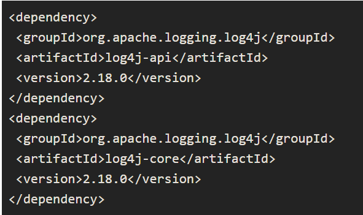
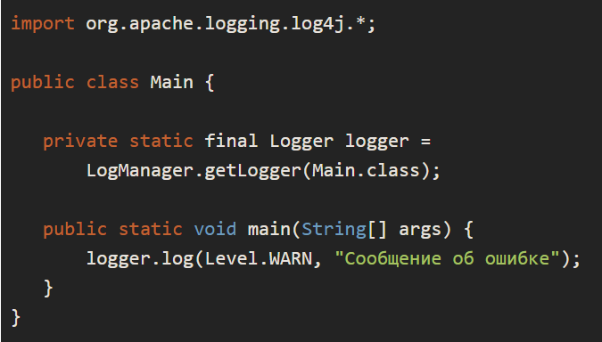

# Цели практической работы
+ Научиться использовать механизм исключений при помощи их создания и отлова в коде.
+ Научиться писать конфигурацию для логирования событий при исполнении программы.
+ Освоить написание тестов для классов, используя библиотеку JUnit.

## Что входит в работу
1. Защита от некорректных данных и преждевременного завершения метода, внедрение логирования.
2. Тесты для проекта SPBMetro и исправление ошибки.

## Задание 1. Защита от некорректных данных и преждевременного завершения метода, внедрение логирования
**Что нужно сделать**

Выполните задание в репозитории java_basics в проекте ExceptionsDebuggingAndTesting/homework_1/ConsoleCustomerList.

+ Проект ConsoleCustomerList — консольное приложение, в котором можно хранить список клиентов. Запустите его, введите слово help в консоль и нажмите Enter. Программа выведет список доступных команд и примеры их выполнения.
+ Поэкспериментируйте с программой: попробуйте ввести различные значения и команды, которые не будут соответствовать примерам. Добейтесь того, чтобы программа «вылетела», то есть произошёл Exception.
+ Напишите в классе CustomerStorage проекта ConsoleCustomerListвсе варианты защиты от некорректных данных, которые вам удастся придумать и обнаружить. Создайте собственные классы исключений, которые должны выбрасываться:
  + при некорректном количестве компонентов в переданной строке с данными;
  + при неверном формате номера телефона;
  + при неправильном формате e-mail.
+ Защитите программу от преждевременного завершения метода addCustomer() — напишите код, который будет отлавливать исключения и выводить эту информацию в консоль в понятном пользователю виде и в лог (см. ниже).
+ Подключите библиотеку log4j2 к проекту:

Пример использования:

+ Сделайте два отдельных лога в папке logs проекта с помощью log4j2 и настройте конфигурацию log4j следующим образом:
  + logs/queries.log — заполняется информацией обо всех запросах к приложению;
  + logs/errors.log — заполняется информацией обо всех ошибках (возникших исключениях со всеми деталями).
Подробнее о том, как настраивать конфигурацию читайте в статье.
+ Запустите в проекте тесты и убедитесь, что они выполняются успешно. 

 ## Задание 2. Тесты для проекта SPBMetro и исправление ошибки
  ### Что нужно сделать
  Выполните задание в репозитории java_basics в проекте ExceptionsDebuggingAndTesting/homework_2.

+ Напишите тесты на все методы класса RouteCalculator в проекте SPBMetro.
+ С помощью тестов и отладки исправьте ошибку, которую вы найдёте в проекте SPBMetro в классе RouteCalculator.

### Советы и рекомендации
+ Сформируйте в тестовом классе схему метро (StationIndex), в которой можно построить хотя бы один маршрут с двумя пересадками. Сделайте небольшую схему, чтобы легче в ней ориентироваться.
+ Чтобы протестировать приватные методы класса RouteCalculator, используйте различные аргументы метода getShortestRoute()для вызова методов без пересадок, с одной и двумя пересадками.
+ Code Coverage — инструмент в IDEA, определяющий уровень покрытия тестами классов, методов и строк. Чтобы запустить тесты с проверкой покрытия, надо нажать правой кнопкой мыши по классу директории с тестами и выбрать Run All tests with Coverage. Желательно добиться 100%-го покрытия методов класса RouteCalculator.