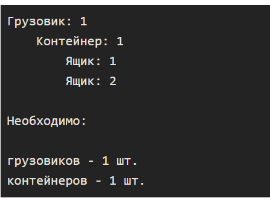

8.10 Практическая работа (автотесты)
Закрепите полученные знания, выполнив практическую работу. Оба задания обязательны для выполнения и сдачи на проверку.

Выполнить работу будет гораздо проще после самостоятельной практики. Задания для неё мы разместили под некоторыми видео этого модуля.

В этой практической работе используются автотесты. Подробнее с тем, как работать с автотестами, вы можете ознакомиться в инструкции:

Инструкция по работе с автотестами (обязательна для ознакомления) https://skillbox-manuals.github.io/manuals/docs/autotests-java/
Обязательно проверяйте свой код локально на своём компьютере перед отправкой в репозиторий по видеоинструкции:

Видео, как запускать и работать с тестами https://www.youtube.com/watch?v=M6YI5ptOVbQ

**Задание 1**

Цель Научиться работать с циклами и, в частности, с операцией целочисленного деления.

**Что нужно сделать**

Представьте, что вы доставляете груз в ящиках одинакового размера. У вас есть грузовики и контейнеры. В каждый грузовик помещается максимум 12 контейнеров. В каждый контейнер — не более 27 ящиков. Ящики, контейнеры и грузовики пронумерованы.

Выполняйте задание в репозитории “java_NumbersAndDates”.

Напишите в классе src/main/java/practice/TrucksAndContainers.java программу, которая распределит ящики по контейнерам и грузовикам в зависимости от их количества.

Программа должна также выводить необходимое для этого число грузовиков и контейнеров исходя из количества ящиков, введённого пользователем после запуска программы.

Пример вывода программы для двух ящиков:

Запустите в проекте тесты и убедитесь в том, что они выполняются успешно. Если всё получилось, поздравляем! Теперь вы умеете пользоваться как простыми математическими операторами, так и специальными функциями в языке Java!

Если тесты не выполняются и выдают информацию об ошибках, постарайтесь самостоятельно исправить эти ошибки и добиться успешного выполнения тестов.

Советы и рекомендации

Для добавления отступа слева используйте символ табуляции \t.
Для переноса строк используйте строку, возвращаемую методом System.lineSeparator(). Этот метод возвращает системный перенос строки той операционной системы, на которой запущено приложение, так как в MacOS, Windows и Linux используются разные символы переноса строк: для Windows это \r\n, а для MacOS и Linux — \n.
Используйте для вычислений арифметическую операцию «остаток от деления»:
System.out.println(45 % 10); // вывод будет 5.

Критерии оценки работы

Принято: 

Количество грузовиков и контейнеров выводится верно при любом количестве ящиков.
Автоматические тесты выполняются успешно.
На доработку: задание не выполнено, выполнено неточно либо частично, автотесты не выполняются.

Как отправить работу на проверку

Выполните также второе задание (смотрите ниже) и отправьте куратору результаты сразу по обоим заданиям.

**Задание 2**
Цель - Научиться создавать объекты класса LocalDate, прибавлять к дате годы и сравнивать даты между собой.

**Что нужно сделать**

Выполняйте задание в репозитории “java_NumbersAndDates” в классе src/main/java/practice/Birthdays.java.
Реализуйте метод:
public static String collectBirthdays(int year, int month, int day),

который вернёт строки, содержащие все ваши прошедшие дни рождения от момента рождения до текущей даты в требуемом формате. Дата рождения передаётся в метод тремя числами.

Формат требуемого вывода, если ваш день рождения — 31 декабря 1990 года, а сейчас — 1 апреля 2022 года:
0 - 31.12.1990 - Mon
1 - 31.12.1991 - Tue
2 - 31.12.1992 - Thu
3 - 31.12.1993 - Fri
4 - 31.12.1994 - Sat
5 - 31.12.1995 - Sun
6 - 31.12.1996 - Tue
7 - 31.12.1997 - Wed
8 - 31.12.1998 - Thu
9 - 31.12.1999 - Fri
10 - 31.12.2000 - Sun
11 - 31.12.2001 - Mon
12 - 31.12.2002 - Tue
13 - 31.12.2003 - Wed
14 - 31.12.2004 - Fri
15 - 31.12.2005 - Sat
16 - 31.12.2006 - Sun
17 - 31.12.2007 - Mon
18 - 31.12.2008 - Wed
19 - 31.12.2009 - Thu
20 - 31.12.2010 - Fri
21 - 31.12.2011 - Sat
22 - 31.12.2012 - Mon
23 - 31.12.2013 - Tue
24 - 31.12.2014 - Wed
25 - 31.12.2015 - Tue
26 - 31.12.2016 - Sat
27 - 31.12.2017 - Sun
28 - 31.12.2018 - Mon
29 - 31.12.2019 - Tue
30 - 31.12.2020 - Thu
31 - 31.12.2021 - Fri

Запустите в проекте тесты и убедитесь в том, что они выполняются успешно. Если всё получилось, поздравляем! Теперь вы умеете пользоваться как простыми математическими операторами, так и специальными функциями в языке Java!

Если тесты не выполняются и выдают информацию об ошибках, постарайтесь самостоятельно исправить эти ошибки и добиться успешного выполнения тестов.

Советы и рекомендации

Создайте в начале метода две переменные класса LocalDate: birthday и today. После этого напишите цикл, в котором добавляйте один год к birthday и сравнивайте получившуюся дату с сегодняшней, используя метод isAfter или isBefore. Таким образом у вас будет проверяться не только год, но и день, что позволит точно выводить данные о прошедших днях рождениях.
Для переноса текста на новую строку используйте символ переноса строки, который возвращается методом System.lineSeparator():
String text = text + "Строка с датой" +

System.lineSeparator();

Этот метод возвращает системный перенос строки — тот, который используется в вашей операционной системе по умолчанию. В Windows это \r\n, в MacOS и Linux — \n.