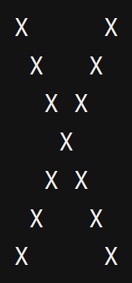

Задание №1

Задание выполняйте в классе

src/main/java/practice/reverseArray/ReverseArray.java

Что нужно сделать

В классе ReverseArray реализуйте метод reverse(), который должен поменять порядок элементов на обратный и вернуть тот же самый массив.
Проверьте ваш код с помощью тестов.
Пример

Первоначальный массив: [“a”, “b”, “c”, “d”].

Массив с элементами в обратном порядке: [“d”, “c”, “b”, “a”].

Задание №2

Задание выполняйте в классе

src/main/java/practice/hospital/Hospital.java

Что нужно сделать

Напишите код метода generatePatientsTemperatures(), который должен сгенерировать массив float, содержащий значения температур пациентов от 32 до 40 градусов.
В методе getReport()вам требуется составить строку с отчётом по значениям температур в массиве с пациентами:
Соберите в строку список температур пациентов.
Рассчитайте среднее арифметическое значение температуры.
Посчитайте количество здоровых пациентов с температурой от 36,2 до 36,9 градусов.
Проверьте свой код с помощью тестов.

Задание №3

Задание выполняйте в классе src/main/java/practice/twoDimensionalArray/TwoDimensionalArray.java

Цель задания

Закрепить навыки работы с массивами, используя двумерный массив.

Что нужно сделать

В классе TwoDimensionalArray   реализуйте метод

public static char[][] getTwoDimensionalArray(int size) {

который должен создать двумерный массив размера size, на диагоналях которого должны быть символы 'X', в остальных ячейках пробел ' '.

Если распечатать массив сформированный методом getTwoDimensionalArray с аргументом 7, то должны получить:

 